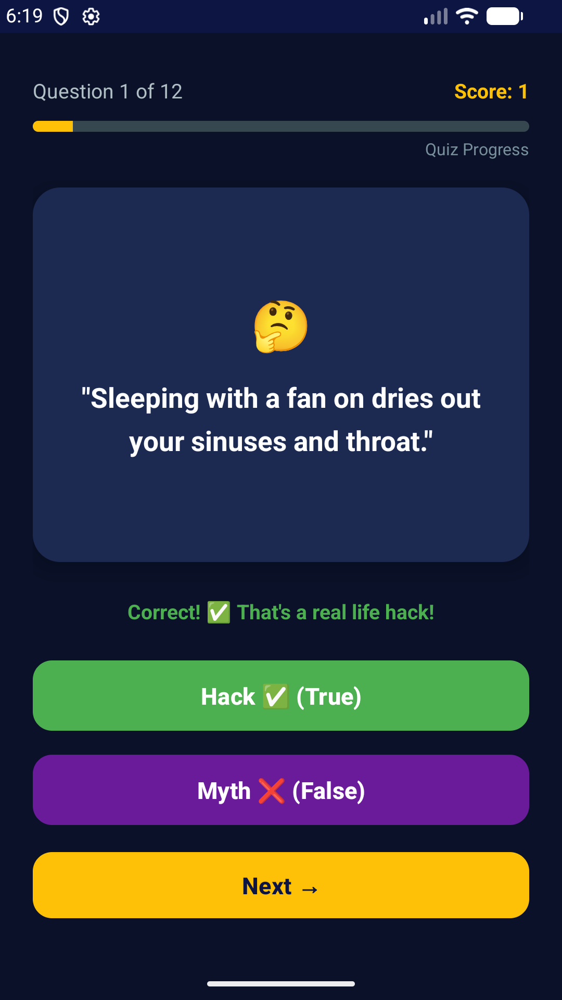
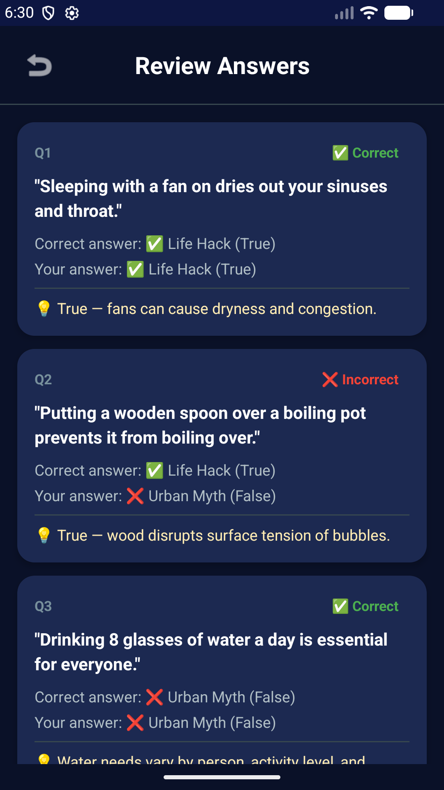

Hack or Myth?

**Hack or Myth?** is an engaging Android flashcard quiz game that challenges users to determine whether common life advice statements are genuine life hacks or just urban myths. The app helps users develop critical thinking skills and bust everyday misconceptions in a fun, interactive way.

### The problem it solves
In the age of misinformation, many people believe common myths and misconceptions without questioning them. This app educates users in an entertaining format — turning myth-busting into a game that rewards knowledge and curiosity.

---

## Features

- **Flashcard-based quiz** — Swipe through 12 unique life hack vs. myth questions
- **Randomized questions** — Questions are shuffled each playthrough for replayability
- **Instant feedback** — Animated feedback after each answer with color-coded buttons
- **Progress tracking** — Real-time progress bar and score counter
- **Personalized results** — Three-tier feedback system based on your final score
- **Answer review** — Comprehensive review screen with explanations for every question
- **Replay support** — Play again with freshly shuffled questions
- **Screen rotation safe** — State is preserved during configuration changes
  **Modern dark theme** — Deep blue + amber accent Material Design 3 UI
  **CI/CD pipeline** — Automated builds and tests with GitHub Actions

---

## Screenshots

| Welcome Screen | Question Screen | Score Screen | Review Screen |
|:-:|:-:|:-:|:-:|
|  |  |  |  |

---

## How to run locally

### Prerequisites
- [Android Studio](https://developer.android.com/studio) (Hedgehog or later recommended)
- JDK 17
- Android SDK (API 34)
- An Android emulator or physical device (API 24+)

### Steps

1. **Clone the repository**
   ```bash
   git clone https://github.com/YOUR_USERNAME/life-hack-or-urban-myth.git
   cd life-hack-or-urban-myth
   ```

2. **Open in Android Studio**
   - Launch Android Studio
   - Select **File → Open** and navigate to the cloned project directory
   - Wait for Gradle sync to complete

3. **Run the app**
   - Select an emulator or connected device
   - Click the **Run ▶** button (or press `Shift + F10`)
   - The app will build and launch on your selected device

4. **Build APK manually (optional)**
   ```bash
   ./gradlew assembleDebug
   ```
   The APK will be generated at: `app/build/outputs/apk/debug/app-debug.apk`

---

## Design Considerations

### UI Choices
- **Dark theme with deep blue background** — Reduces eye strain and gives a premium, modern feel
- **Amber accent color** — Provides strong contrast against the dark blue for important interactive elements
- **Card-based flashcard layout** — CardView creates a clear visual container for the quiz statement, making it feel like a real flashcard
- **Emoji-enhanced UI** — Emojis add personality and make the app feel approachable without needing custom icons
- **Material Design 3** — Ensures the app follows modern Android design guidelines for consistency

### Flashcard Logic (Loop/Index Approach)
The quiz uses an **index-based iteration** approach rather than recursion:
1. Questions are loaded from `FlashcardData.kt` and **shuffled** at the start of each session
2. A `currentIndex` variable tracks the current question position
3. When the user presses "Next", the index increments (`currentIndex++`)
4. The `displayQuestion()` function reads the flashcard at `flashcards[currentIndex]`
5. When `currentIndex` reaches the end of the list, the quiz navigates to the Score screen

This approach is:
- **Memory efficient** — No recursive call stack buildup
- **State-friendly** — Easy to save/restore `currentIndex` on configuration changes
- **Predictable** — Simple linear flow through the question list

### Score Feedback Thresholds
| Score Range | Tier | Message |
|:-:|:-:|:--|
| ≥ 7 | 🏆 High | "Master Hacker!" |
| 4 – 6 | 👍 Medium | "Great job! Keep it up!" |
| < 4 | 📚 Low | "Stay Safe Online! Keep practising!" |

These thresholds provide encouraging feedback at every level — rewarding high scores while motivating lower scorers to try again.

---

## ⚙️ GitHub Actions — Automated Build

### What the Workflow Does
The CI pipeline (`.github/workflows/build.yml`) automates the build and test process:

1. **Triggers** on every push and pull request to the `main` branch
2. **Sets up** JDK 17 (Temurin distribution) with Gradle caching for faster builds
3. **Builds** the debug APK using `./gradlew assembleDebug`
4. **Runs** all unit tests using `./gradlew test`
5. **Uploads** the generated APK as a downloadable build artifact

### Why Automated Builds Matter
- **Catches bugs early** — Every push is automatically tested before merging
- **Ensures consistency** — Builds run in a clean, reproducible environment
- **Saves time** — No manual build-test-upload cycle required
- **Team confidence** — Build status badges show project health at a glance

---

## 🧪 How to Run Tests

### Run all unit tests
```bash
./gradlew test
```

### Test Coverage
The test suite (`FlashcardUnitTest.kt`) includes:

| # | Test | Description |
|:-:|:--|:--|
| 1 | `flashcard_dataClass_storesValuesCorrectly` | Verifies Flashcard data class stores hack values |
| 2 | `flashcard_dataClass_storesMythCorrectly` | Verifies Flashcard data class stores myth values |
| 3 | `scoreFeedback_returnsCorrectTier` | Tests all three feedback tiers (high/medium/low) |
| 4 | `scoreCalculation_incrementsCorrectly` | Simulates all-correct quiz and validates score |
| 5 | `flashcardData_containsAtLeast10Questions` | Ensures minimum question count |
| 6 | `shuffledFlashcards_containSameElements` | Validates shuffle preserves all questions |
| 7 | `flashcardData_allFieldsNonEmpty` | Checks no empty statements or explanations |
| 8 | `getTotalQuestions_returnsCorrectCount` | Verifies total count function |
| 9 | `scoreCalculation_zeroWhenAllWrong` | Validates zero score on all wrong answers |
| 10 | `flashcard_equalityWorks` | Tests data class equality semantics |

---

## Project Structure

```
app/
├── src/
│   ├── main/
│   │   ├── java/com/lifehack/lifehackorurbanmyth/
│   │   │   ├── WelcomeActivity.kt         ← Welcome/landing screen
│   │   │   ├── QuestionActivity.kt        ← Flashcard quiz screen
│   │   │   ├── ScoreActivity.kt           ← Results & feedback screen
│   │   │   ├── ReviewActivity.kt          ← Answer review screen
│   │   │   ├── data/
│   │   │   │   ├── Flashcard.kt           ← Data class
│   │   │   │   └── FlashcardData.kt       ← Question bank & logic
│   │   │   └── adapters/
│   │   │       └── ReviewAdapter.kt       ← RecyclerView adapter
│   │   ├── res/
│   │   │   ├── layout/                    ← XML layouts for all screens
│   │   │   ├── values/                    ← Colors, strings, themes
│   │   │   ├── anim/                      ← Feedback animations
│   │   │   └── drawable/                  ← Custom drawables
│   ├── test/
│   │   └── java/.../FlashcardUnitTest.kt  ← Unit tests
├── .github/workflows/build.yml            ← CI/CD pipeline
├── .gitignore
└── README.md
```

---

## Video Presentation

(https://www.youtube.com/shorts/ZM1v5wYhtpM)

---

## Author

**Evelyn Akeyo**

- GitHub: (https://github.com/EvelynAkeyo)

---

## License

## 📘 Note

This project was developed for educational purposes as part of a school assignment.
